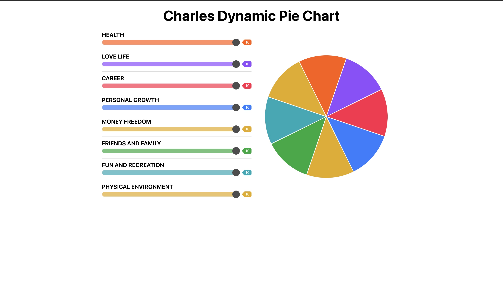

## Table of contents

- [General info](#general-info)
- [Technologies](#technologies)
- [Setup](#setup)

## General info

This project is simple Dynamic pie chart.

## Technologies

Project is created with:

- node version: v14.16.1
- npm version: 7.24.2
- React version: 17.0.2

## Setup

To run this project, install it locally using npm:

```
$ git clone https://github.com/CharlesSin/dynamic-pie-chart.git
$ cd dynamic-pie-chart
$ npm install
$ npm start
```


